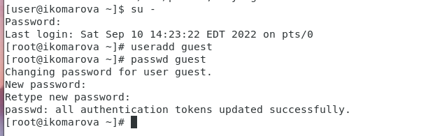
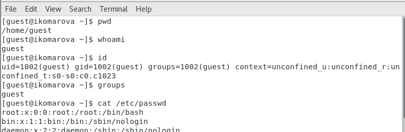
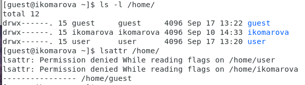
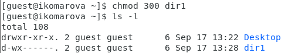
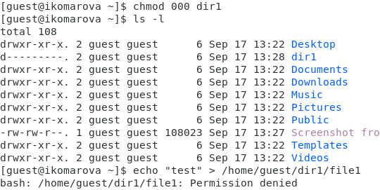
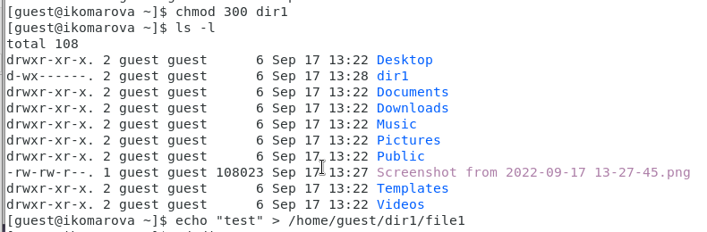
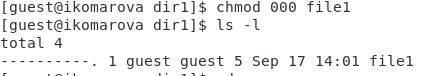
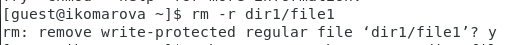
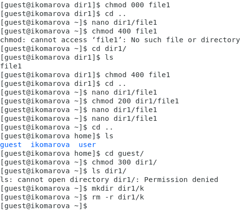
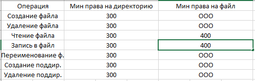

# Презентация к лабораторной работе 2.
## Дискреционное разграничение прав в Linux. Основные атрибуты

## Выполнила студентка группы НФИбд-02-19: Комарова Ирина Сргеевна 1032192866

## Задание
    Целью данной работы является Получение практических навыков работы в консоли с атрибутами файлов, 
	закрепление теоретических основ дискреционного разграничения доступа в современных системах с открытым 
	кодом на базе ОС Linux.

## Ход работы.
1. Создала учётную запись пользователя guest командой: useradd guest
2. Зада пароль для пользователя guest (использую учётную запись администратора): passwd guest

3. Вошла в систему от имени пользователя guest.
4. Определила директорию, в которой нахожусь, командой pwd. Я уже была в своей домашней директории.
5. Уточнила имя пользователя командой whoami.
6. Уточнила имя пользователя, его группу, а также группы, куда входит пользователь, командой id. 
7. Просмотрела файл /etc/passwd командой: cat /etc/passwd
Нашла в нём свою учётную запись. Определила uid пользователя.
Определила gid пользователя.

9. Определила существующие в системе директории командой
ls -l /home/

10. Проверила, какие расширенные атрибуты установлены на поддиректориях, находящихся в директории /home, командой:
lsattr /home
11. Создала в домашней директории поддиректорию dir1 командой
mkdir dir1
Определила командами ls -l и lsattr, какие права доступа и расширенные атрибуты были выставлены на директорию dir1.
12. Сняла с директории dir1 все атрибуты командой
chmod 000 dir1
и проверила с её помощью правильность выполнения команды
ls -l

13. Попыталась создать в директории dir1 файл file1 командой
echo "test" > /home/guest/dir1/file1
Получила отказ
ls -l /home/guest/dir1
14. Провела работу с таблицей и доступами. 

15. Получила следующую таблицу:

## Вывод 
    Я обрела практические навыки работы с консолью.

## Библиография
1. Методические материалы курса. “Информационная безопасность компьютерных сетей” Кулябов Д. С.,Королькова А. В., Геворкян М. Н.